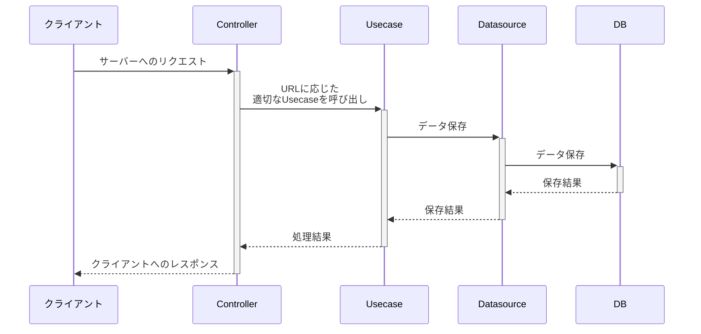
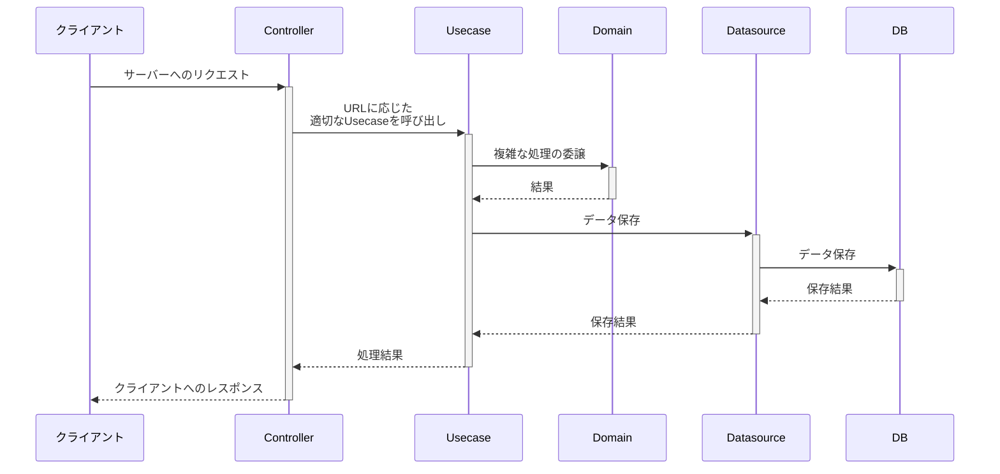

[WIP]

# 学習用レポジトリ

## 開発のコツ

フロントエンドでもバックエンドでも、開発時にプログラムの全体像を何も考えずにいきなりコードを書き始めてしまうと運用・保守が難しくなります。（付け焼き刃で開発を進めると、その内コードが破綻してしまうため）

開発を始める前にプログラムの全体像を設計しておくと、新しい機能の実装などでファイルを追加する際に、どこにファイルをまとめておけば良いか判断がつきやすくなります。

後述の「設計の全体図」は、バックエンドの API を役割ごとに分割したものです。

役割ごとにファイルを分割することで以下のメリットがあります。

- 処理を局所化することで、不具合の修正・機能の追加をする際に影響範囲を限定的にできる
  - カプセル化
- テストが書きやすい
  - ファイルごと(クラスごと)に小さい単位でテストが書ける
- 頭の中が整理しやすくなる
  - 役割ごとにファイルを分けて実装することで、1 度に考えなくてはいけないことも少なくすむ

このような、1 つのクラスには特定の役割だけを持たせ役割以外のことをさせないことを「[単一責任の原則](https://ja.wikipedia.org/wiki/%E5%8D%98%E4%B8%80%E8%B2%AC%E4%BB%BB%E3%81%AE%E5%8E%9F%E5%89%87)」といったりもします。

興味があればぜひ調べていただけたらと思います。

## 設計の全体図

図中の「クライアント」がフロントエンド、「Controller から右」はバックエンドと考えてください。

### Usecase がシンプルな場合

### Usecase が複雑になる場合

Usecase 内の処理が複雑になりそうな場合、複雑になりそうな処理を行う専用のクラスを作成して、その専用クラスに処理を委譲する。

## 参考資料

ファイル・クラスの整理や設計についてもう少し体系的に学びたい場合は、以下の本を読むと良いかと思います。

- [ドメイン駆動設計入門 ボトムアップでわかる! ドメイン駆動設計の基本](https://amzn.to/4a9YMKo)
- [現場で役立つシステム設計の原則 〜変更を楽で安全にするオブジェクト指向の実践技法](https://amzn.to/4aeUWj5)
- [Code Complete 第 2 版 上　完全なプログラミングを目指して](https://amzn.to/3PG0pay)
  - 5 章 コンストラクションにおける設計
  - 6 章 クラスの作成
